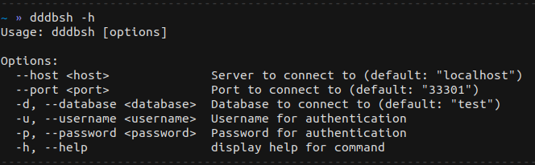
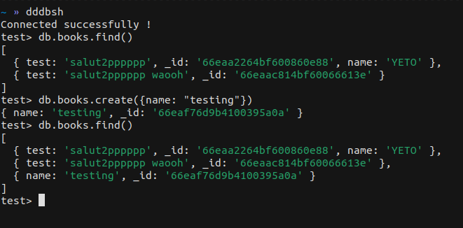

# dddb (3db) Lightweight Database Server

This project is a lightweight, real-time database server inspired by MongoDB but designed to be simpler and more compact, written entirely in C. It aims to provide basic database functionalities with support for real-time features, allowing applications to interact with the database and receive updates in real time.

**Current Status**:  
The project is still a work in progress. Some functionalities, especially the data retrieval and storage methods, are not fully optimized yet. Additionally, index support will be introduced in future versions to enhance query performance.


## Features
- **Real-time Updates**: Clients can subscribe to changes in the database and receive notifications when data changes.
- **Simple Storage**: Basic operations for storing and retrieving JSON-like data.

## Roadmap
- **Optimization**: Current methods, such as finding and retrieving data, are not optimized and could be slow on larger datasets.
- **Indexing**: Future versions will introduce support for indexes to improve query performance.
- **Authentication**: Basic authentication is in place (a POC), but more secure methods will be developed.

## Get Started

### Prerequisites

Make sure you have the following installed on your system:

- GCC (or any C compiler)
- `libevent` library (not required now)
- `make`

### Installation

1. Clone this repository to your local machine:

    ```bash
    git clone https://github.com/dinyad-prog00/dddb.git
    ```

2. Navigate to the project directory:

    ```bash
    cd dddb/dddb
    ```

3. Build the project using `make`:

    ```bash
    make
    ```

4. Run the server:

    ```bash
    make run
    ```

### Debugging

If you want to run the server with GDB for debugging purposes:

```bash
make debug
```

## Additional Components

- **Node.js Driver**: The project includes a Node.js driver located in [`drivers/nodejs/dddb`](drivers/nodejs/dddb). To install and use the driver locally, refer to the instructions in [`drivers/nodejs/dddb/README.md`](drivers/nodejs/dddb/README.md).

- **CLI Client**: A command-line interface (CLI) client called `dddbsh` (DDDB Shell) is available in [`clients/dddbsh`](clients/dddbsh). This client allows you to interact with the 3DB server from the terminal. Refer to [`clients/dddbsh/README.md`](clients/dddbsh/README.md)


  


  


- **Node.js Test Project**: A Node.js test project is included in the repository under [`test-project`](test-project) to demonstrate usage of the Node.js driver and interact with the 3DB server.

